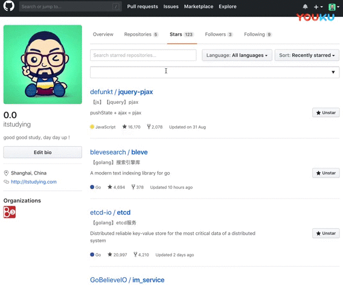

# github-extend
chrome插件，对github站点的功能做扩充

## 下载
- [releases下载](https://github.com/itstudying/github-extend/releases) 
- [chrome应用商店](https://chrome.google.com/webstore/detail/github-extend/aaeeanhgphgejffojboafjdlfbbmgfld)

## 介绍

    1. star、仓库页和项目首页添加项目备注
    2. star页搜索框对添加的备注和备注名称进行模糊搜索
    3. 备注根据当前github id区分用户
    4. chrome登录google账号后支持同步备注，多个设备共用备注数据，不能同步就保存在本地

---

注意：***插件卸载后备注记录就没有了***，原本是想把私钥公开的便于用户自己升级，又觉得不太好还是算了，如果需要的话联系我

